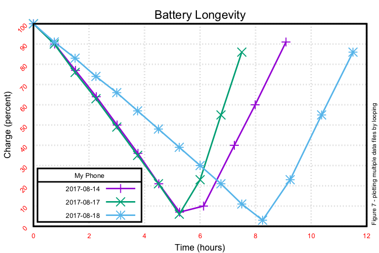

# gnuplot ~ top-level

Our [innumeracy](https://www.wikiwand.com/en/Numeracy) prevents many from interpreting the wave of data that inundates us, especially percentages of improvement ("this is _n_ percent as fast as _m_ is") or rates of change. Lucky for us, humans have evolved to be particularly good at interpreting graphic information (lest they be eaten by predators).  Consider the following bit of tabular data:

| human time       | battery level | elapsed_time_secs |
|------------------|---------------|-------------------|
| 05/02/2017 21:50 | 100           | 2                 |
| 05/02/2017 22:20 | 91            | 1802              |
| 05/02/2017 22:50 | 81            | 3602              |
| 05/02/2017 23:20 | 71            | 5402              |
| 05/02/2017 23:50 | 61            | 7202              |
| 05/03/2017 00:20 | 50            | 9003              |
| 05/03/2017 00:50 | 40            | 10803             |
| 05/03/2017 01:20 | 29            | 12603             |
| 05/03/2017 01:50 | 18            | 14403             |
| 05/03/2017 02:20 | 7             | 16203             |

Only a very tiny minority will be able to see the battery usage curve described by the numbers. Consider the following graph:

Most people can immediately grasp the phone battery's longevity and rate of decay. It's the gap between the tabular and graphic representation of the data that makes generating graphics ("plotting") compelling.

Google Sheets and Microsoft Excel both have the ability to plot graphs, but they suffer from (1) limited functionality, (2) manual configuration of the graph each and every time you plot, (3) a complete inability to deal with (a) dynamic data and (b) intelligent, conditianal plotting of data. These are serious limitations if you spend any significant part of your day working with data.

[gnuplot](http://gnuplot.cvs.sourceforge.net/), a command-line program that generates two- and three-dimensional graphical plots of functions and data, suffers from none of these limitations. In fact, gnuplot can be programmatically driven by an application that alters the output based upon the input, something I'll be demonstrating. This is eye-openingly wondurful once you get into your data and realize that you want to call out some particular characteristics, or omit inappropriate data.

There's an awful lot of gnuplot documented online, many with pretty trivial examples. My contributions extend what I've found online to describe how I solved my real-world needs, complete with commentary and complete source code.

<table>
	<tr>
		<td width="20%"></td>
		<td><a href="./non_trivial_intro/README.md">gnuplot ~ a non-trivial introduction</a> covers gnuplot installation, deployment, and from basic use cases through having gnuplot calculate and elide data you don't want to see. Start here to cover your basic plotting needs.</td>
	</tr>
	<tr>
		<td></td>
		<td><a href="./graphing_ping/README.md">Real-time monitoring and graphing of ping</a> covers (1) how to dynamically generate data for gnuplot, (2) how to programmatically create commands for gnuplot, and (3) how to display gnuplot output in real-time in a terminal window.</td>
	</tr>
</table>

