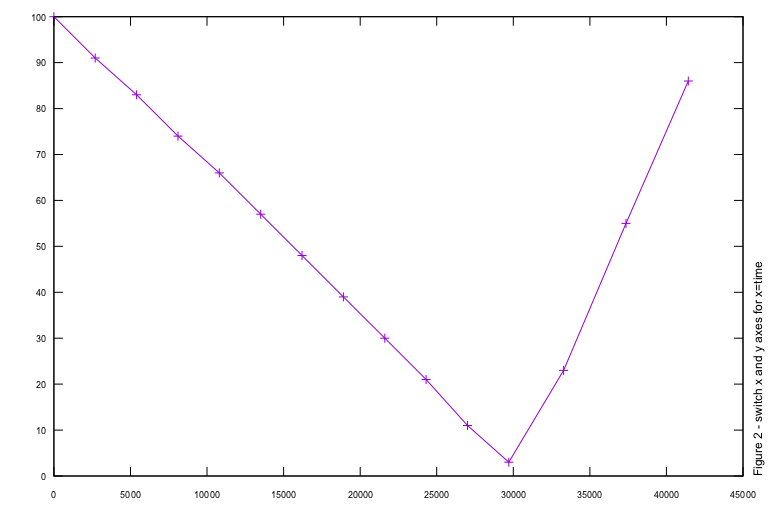
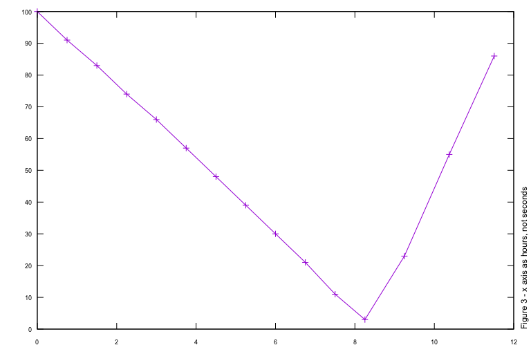
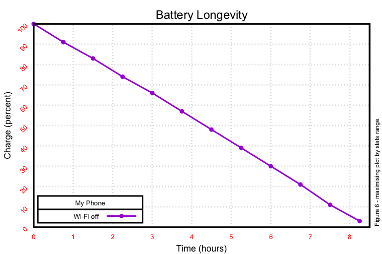

# gnuplot ~ a non-trivial introduction

We are awash in data. Often the best - or only - way to understand the meaning of data is graphic; humans have been extracting meaning from images far longer than from tabular text. Today I'll present an introduction to graphing (plotting) data with [gnuplot](http://gnuplot.cvs.sourceforge.net/), a command-line program that generates two- and three-dimensional graphical plots of functions and data.


The advantages to using a command-line-driven program are that it can be easily scripted into computational workflows and repeated as needed. gnuplot runs on all major computers and operating systems, is free, and is therefore no impediment to creating cross-platform solutions. gnuplot can plot directly on screen, in many graphic file formats, and in [LaTeX](http://www.latex-project.org/). It can be used both interactively and in a scripted, batch mode; we explore only the latter.

gnuplot was first released in 1981, so it carries a cachet of longevity, and comes with a large and far-flung user community; things helpful to us.

I call this a "non-trivial introduction" because in contrast with the myriad web pages which present the same basic information, I'll quickly move to a real-world plotting need that (1) I needed to solve (2) shows off some of gnuplot's power and ease-of-use.

Note: In addition to the aforementioned web pages, there's also the [offical user manual](http://www.gnuplot.info/docs_5.0/gnuplot.pdf), and the exhaustive book [Gnuplot in Action](https://www.manning.com/books/gnuplot-in-action-second-edition).

## Obtaining and installing gnuplot

Rather than duplicate published instructions for every operating system out there, allow me to invite you to find the appropriate method for obtaining and installing gnuplot.

## Baby steps

Nothing happens without data. Here's a sample of the data that we'll be plotting; I keep it in the file `data.csv`. Significant things to note are:

1. the data are two colums of related information, the first quantity is a battery percentage and the second is elapsed time, in seconds.
2. the datasets start with a full battery (a number at or near 100%), decrease towards an empty battery (0%), and [optionally] rise back towards full as the phone is plugged back in.
3. the data are presented in [comma-separated value](https://en.wikipedia.org/wiki/Comma-separated_values) (CSV) format.

```
100,0
77,7202
51,15304
24,23407
2,30609
33,34650
65,38718
86,41430
100,44132
```


To create the plot above, create a file `1.gp` with the contents

```
set terminal svg size 768,512			# background rgb 'white'
set datafile separator ","				# needed to process CSV files
file='data.csv'							# our input comes from here
set output '1.svg'						# our output goes there
plot file with linespoints				# and this does the plotting
```

Then type `gnuplot 1.gp` to create the output image file `1.svg`.

That was easy! You've got a plot with

- axes (time in seconds on the left; the 'y' axis
- battery level on the bottom; the 'x' axis
- tics (numbers on the axes)
- a key (legend) in the upper right.

If this meets your needs, great! You're done!

## Righting wrongs

I'm not done. I need the time axis to be on the bottom, as is customary in my world. I want the columns processed as time vs level, so column 2 vs column 1.

```
plot file using 2:1 with linespoints
```



For my brain (at least) this is better: I can intuitively see the battery starting full, discharging, then recharging. Done!

## A seconds look

While thrilled to have the time axis on the bottom, I'm not loving the time expressed in seconds. I don't think in terms of seconds for my phone's battery life. To cause the x axis to show in hours (each of which is 3600 seconds), try:

```
plot file using ($2/3600):1 with linespoints
```



Okay, now we've got a minimally acceptable plot. With this I could be satisfied.

## Don't label me, bro

One more tweak comes to mind: labeling the data points. Yes, you could trace your finger over and up and figure out each point's position, but why? Having gnuplot do it will teach two things:

- gnuplot can process one dataset multiple times, each with different styles
- the "string print function" `sprintf()` will give you power to create text strings just perfect for your needs
- the continuation character `\` will make your batch scripts more readable and maintainable


To generate a labeled plot, we first trace the `linespoints` style seen before, and then process the same data with the `labels` style.

```
plot \
	file using ($2/3600):1 with linespoints, \
	file using ($2/3600):1:(sprintf( '(%d,%d)', ($2/3600), $1)) \
		notitle with labels offset 3,0
```

Here are the salient points in our changed code:

- one `plot` command, multiple plots separated by a comma
- the continuation character `\` makes one long line much easier to understand
- `notitle` prevents the same data appearing twice in the legend
- `with labels offset 3,0` slides the labels away from the point, for readability

## Pretty in pink

We've done a decent job of presenting the data in an easier-to-understand way, and we could leave now. There's a world of difference between the default gnuplot styles and what it can do. Here's the unlabelled plot all gussied up:


Whoa! This plot commands respect! Okay, the dark gray grid is muted and shows off the plotlines. How did we do it?

```
set terminal svg size 768,512 linewidth 3 # background rgb 'white'

# global changes for all plots
set pointsize 2								# globally set points to this size
set style data linespoints					# globally set lines to this style

# chart title and axes labels
set title  'Battery Longevity' font ',32' offset 0,-2,0
set xlabel 'Time (hours)' font ',24' offset 0,0.2,0
set ylabel 'Charge (percent)' font ',24' offset 1,0,0

# background grid (linetype 0 = dashed lines)
set grid linetype 0 linewidth 1 linecolor rgb '#DCDCDC'

# axes labels
set tics font ', 18' textcolor rgb 'red' nomirror scale 0
set ytics rotate by 45 right

# key (legend)
set key title 'My Phone' bottom left box linewidth 1 font ',18'

plot file using ($2/3600):1 with linespoints \
	pointtype 7 pointsize 1 title 'Wi-Fi off '
```

Rather than disect this line-by-line, I've used the long form of gnuplot commands (`linecolor` instead of `lc`) to make it easy for you to research and discover the many ways to customize plots.

## Not all points are created equal

Just as you're leaning back in your chair, supremely satisfied with the results of this compelling plot, the boss walks by and says the charging portion of the plot is distracting; can you display just the discharging downslope, like this:



Specifically, the task consists of two parts:

- include no points after the battery charge hits bottom
- spread the plot across the width of the graph

```
stats file using ($2/3600):1 prefix "STATS" nooutput
set xrange [0:STATS_pos_min_y]
plot file using ($2/3600):((($2/3600) <= STATS_pos_min_y) ? $1 : 1/0) \
	with linespoints pointtype 7 pointsize 1 title 'Wi-Fi off '
```

Here's what's going on:

gnuplot's `stats` command will process the data (using the columns we've described before) and provide information prefixed with the string "STATS". (You specify a prefix so you can run statistics on several datasets and keep them seperate.

```
stats file using ($2/3600):1 prefix "STATS" nooutput
```

We set the width of the data to be plotted on the x axis to be between 0 (the start of all measurements) and STATS_pos_min_y (the time which corresponds to the minimum battery charge (the y axis)).

```
set xrange [0:STATS_pos_min_y]
```

Plot all the points which satisfy a test (or "conditional" in gnuplot-speak).

The conditional is of the form

```
( test ? success : failure )
```

Since we're limiting points shown based upon time, our test will appear in the specification for the second column. It can be read as:

- test: is the time of this point less than or equal (`<=`) to that time when the battery was at its lowest charge (`STATS_pos_min_y`)"
- success: plot this point with the value of the second column
- failure: plot with the value "one divided by zero" (an invalid math computation that's gnuplot shorthand for "don't display this point"

```
plot file using ($2/3600):((($2/3600) <= STATS_pos_min_y) ? $1 : 1/0) \
```

This was written using gnuplot 5.0p6 on macOS High Sierra (10.13). Thanks to the Internet, especially [stackoverflow](https://stackoverflow.com/).

## Groundhog Day

The boss is so impressed by how you've made the test results so easy to digest that he discloses that there's been tests run daily; can you plot them all together to expose trends and variances between the datasets?

Of course you can!


```
set key opaque					# show legend over plot lines
plots=''						# create before using
files=system("ls -1B data/2017*csv | sort")
do for [ file in files ] {
#	filename=system( 'basename "'.file.'" | sed -e "s/.csv//g"' )
	# "data/2017-MM-DD.csv" -> "2017-MM-DD.csv"
	name_from_path=system( 'basename "'.file.'"' )
	# "2017-MM-DD.csv" -> "2017-MM-DD"
	part_from_name=system( 'basename "'.name_from_path.'" .csv' )

	conditional=sprintf( '($2/3600):1' )
	action=sprintf( '"%s" using %s with linespoints title "%s", ', \
		file, conditional, part_from_name )
	plots=plots.action			# add this plot to the ongoing list
}
eval('plot '.plots)				# finally plot the whole bunch
```

Not too daunting :-) Let's examine this line-by-line.

Create the `plots` variable so we can later store a value into it.

```
plots=''									# create before use
```

This is the non-portable part; you'll have to customize it for whatever operating system you use. This is for all UNIX variants (including Linux and macOS).

List, one per line, the files in the folder (directory) named "data" which end in the file suffix "csv" and sort them alphabetically (to make the key easier to read).

```
files=system("ls -1B data/*csv | sort")
```

Loop over the files, doing the actions specified.

```
do for [ file in files ] {
	# actions on the file go here
}
```

The actions to be done on each file are:

The variable `file` comes to us as `/data/2017-MM-DD.csv`, where `MM` and `DD` are the month and day the measurement were taken. This is too ugly for a good-looking legend. Here's how we trim it down:

```
# "data/2017-MM-DD.csv" -> "2017-MM-DD.csv"
name_from_path=system( 'basename "'.file.'"' )
# "2017-MM-DD.csv" -> "2017-MM-DD"
part_from_name=system( 'basename "'.name_from_path.'" .csv' )
```

Now `file` contains `2017-MM-DD`.

```
conditional=sprintf( '($2/3600):1' )
action=sprintf( '"%s" using %s with linespoints title "%s", ', \
	file, conditional, part_from_name )
```

When done, the variable `action` contains `2017-MM-DD using ($2/3600):1 with linespoints title "2017-MM-DD,"`.

The trailing comma is important, as it separates one action from another. It's needed as we add this action to the list of actions we want to have happen.

```	
plots=plots.action
```

`plots` now contains one plot action per line:

```
"2017-08-14" using ... title "2017-08-14",
"2017-08-17" using ... title "2017-08-17",
"2017-08-18" using ... title "2017-08-18",
```

When we're done constructing plot actions, we have gnuplot evaluate the `plots` variable, and the graph is made.

```
eval('plot '.plots)
```

## Trim the hedges

Finally, let's once again trim away the charging portion of the dataset.


```
my_xrange=0
plots=''
files=system("ls -1B data/2017*.csv | sort")
do for [ file in files ] {
	stats file using ($2/3600):1 prefix "STATS" nooutput

	if ( STATS_pos_min_y > my_xrange ) { my_xrange = STATS_pos_min_y }
print sprintf( "7: my_xrange %f.2 for file %s", my_xrange, file ) ;

	# - - - - - - - - - - - - - - - - - - - - - - - - - - - - - - - - - - - - -
	conditional=sprintf( '($2/3600):((($2/3600) <= %.2f) ? $1 : 1/0)', STATS_pos_min_y )
	filename=system( 'basename "'.file.'" | sed -e "s/.csv//g"' )
	action=sprintf( '"%s" using %s with linespoints title "%s", ', \
		file, conditional, filename )
	plots=plots.action					# add this plot to the ongoing list
}
set xrange [0:my_xrange]				# show only the width calculated
eval('plot '.plots)						# finally plot the whole bunch
```

The section of code to examine is:

```
conditional=sprintf( '($2/3600):((($2/3600) <= %.2f) ? $1 : 1/0)', STATS_pos_min_y )
```

Here we customize the conditional for each dataset, trimming the points plotted to those which come before that dataset's minimum.

## Groundhog day revisited

To finish up this long dive one real-world gnuplot use case, let's plot our current test data against an old bunch of tests.

We don't care about the exact dates of the test, and we don't want to detract from the curent data, so we'll use a muted color and the `notitle` directive to keep these older lines out of the key.


Changes to the previous plot include:

- making a second copy of the `for` loop, specifying the older datasets
- plotting the older datasets first, as gnuplot layers each plot on top of previous ones
- selecting some muted color for the older datasets

The solution to this scenario may be found in the [source code for these plots](./article.gp?ts=4), should you need to look.

## Colophon

You may have noticed that I use the `svg` terminal type (because it generates much better output than the other types I've tried). The only downside to this is the resulting [SVG](https://en.wikipedia.org/wiki/Scalable_Vector_Graphics) files, which are not displayable by web browsers. To generate PNG files, which are displayable, I use [imagemagick](https://www.imagemagick.org/script/index.php), which I install on macOS by:

`brew install imagemagick --with-librsvg`

The following code converts the SVG file and then removes it.

```
my_figs='./figures'
files=system("ls -1B figures/*.svg | sort")
do for [ file in files ] {
	my_file=system( 'basename '.file )
	my_fn=system( 'basename '.my_file.' .svg' )
	print 'post-processing '.file
	file_path=sprintf( '%s/%s', my_figs, my_fn )
	convert=sprintf( 'convert -resize 768x512 -background none "%s.svg" "%s.png" ; rm "%s.svg"', \
		file_path, file_path, file_path )
	system( convert )
```

Okay, done! There you have a deep-dive into how one particular problem was solved (minus the hours of vexing dead-ends and experimentation). BTW, thank you [stackoverflow](https://stackoverflow.com/).

For future note, these plots were done with gnuplot 5.0p6 on macOS High Sierra.
